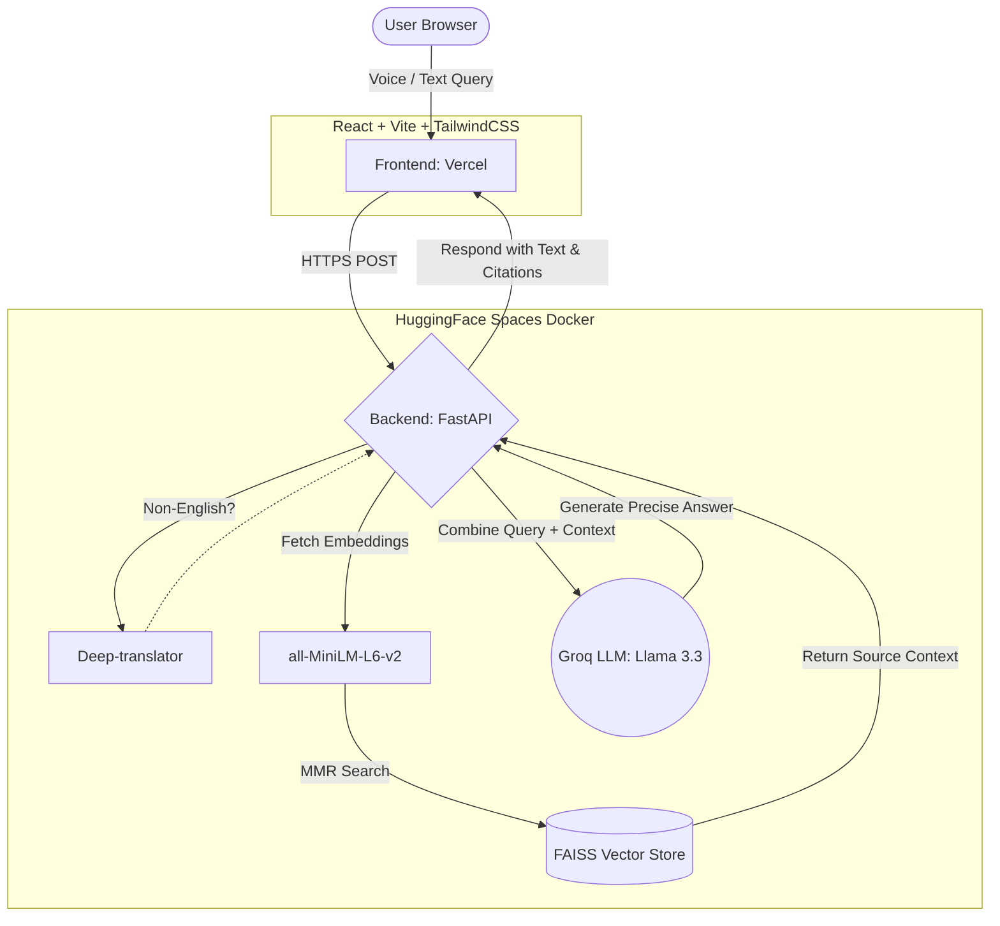

# NPS Bondhu

**Your AI-Powered Guide to the National Pension System**

[](https://npsbondhu.vercel.app)
[](https://huggingface.co/spaces/NilimKr/nps-bondhu-backend)
[](LICENSE)

---

## What is NPS Bondhu?

Navigating the rules and details of the National Pension System (NPS) can often feel overwhelming. NPS Bondhu is designed to simplify this experience. It acts as your intelligent, AI-driven guide, built specifically to answer your questions, clarify pension regulations, and help you understand your retirement planning options.

Rather than manually searching through lengthy official documents, you can ask NPS Bondhu your questions directly. The system searches through official materials from the Pension Fund Regulatory and Development Authority (PFRDA) to provide you with accurate, easy-to-understand answers backed by real citations.

### Core Features

- **AI-Powered Q&A:** Ask complex questions in natural language and receive clear, contextual answers sourced from official documents.
- **Multilingual Support:** Accessible in English, Hindi (हिन्दी), and Assamese (অসমীয়া) to serve a diverse user base.
- **Source Citations:** To ensure trust and verify information, every answer includes a direct reference to the specific document it was retrieved from.
- **Voice Interactions:** For a more natural experience, seamlessly ask questions using your voice via the browser's native Web Speech API.
- **Reliable Knowledge Base:** Operates strictly on a curated database of official PFRDA and NPS Trust circulars, guidelines, and FAQs.

---

## Technical Architecture

The application is built on a modern, decoupled architecture designed for speed and accuracy. 



### Retrieval-Augmented Generation (RAG) Pipeline

1. **Query Processing:** We capture user input either through text or via voice using the Web Speech API in specific locales (en-IN, hi-IN, as-IN). If the query is not in English, it is translated on the fly using `deep-translator`.
2. **Context Retrieval:** The synthesized query is converted into embeddings. We use a FAISS index to run a Maximal Marginal Relevance (MMR) search, which retrieves the most relevant and diverse text chunks from our pre-processed document database.
3. **Citation Management:** During the initial data ingestion phase, every text chunk is paired with metadata specifying its source file and page location. 
4. **Response Generation:** The retrieved context, combined with the original query, is fed into the Llama 3.3 70B model via the fast Groq inference API to generate a precise answer.
5. **Presentation:** The backend formats the citation cleanly by processing the metadata before sending the final textual response back to the frontend to be displayed to the user.

---

## Production Deployment

| Component | Hosting Platform     | Live URL |
|-----------|----------------------|----------|
| Frontend  | Vercel               | https://npsbondhu.vercel.app |
| Backend   | HuggingFace Spaces   | https://NilimKr-nps-bondhu-backend.hf.space |

### Deploying the Backend (HuggingFace Spaces)

1. Create a new Space at huggingface.co/new-space
   - **Environment:** Docker
   - **Name:** `nps-bondhu-backend`
2. Upload the necessary backend files using the provided utility scripts:
   ```bash
   python3 scripts/upload_to_hf.py
   ```
3. Secure your environment by adding your `GROQ_API_KEY` (obtainable from console.groq.com) into the Space's Settings under Variables and Secrets.

### Deploying the Frontend (Vercel)

1. Import the GitHub repository into your Vercel account.
2. Set the Root Directory to `frontend/`.
3. The application is pre-configured; `frontend/.env.production` already contains the correct backend endpoints.
4. Deploy the application.

---

## Local Development Guide

### Prerequisites
- Python 3.10 or higher
- Node.js 18 or higher
- A Groq API key (available for free at console.groq.com)

### 1. Clone and Install Dependencies

```bash
git clone https://github.com/NilimKr/NPS-Bondhu.git
cd "NPS-Bondhu"

# Install backend dependencies
pip install -r requirements.txt

# Install frontend dependencies
cd frontend && npm install && cd ..
```

### 2. Configure Environment Variables

Create a `.env` file in the project's root directory for the backend API key:
```bash
GROQ_API_KEY=your_groq_api_key_here
```

Create a `.env` file inside the `frontend/` directory to configure the local development server:
```bash
VITE_API_BASE_URL=http://127.0.0.1:8000
```

### 3. Run the Servers

Start the backend API server:
```bash
uvicorn backend.main:app --reload --port 8000
```

In a separate terminal, start the frontend application:
```bash
cd frontend && npm run dev
```

You can now view the app by navigating to **http://localhost:5173** in your browser.

### 4. Updating the Knowledge Base (Optional)

If you need to update the application with the latest guidelines or circulars:
```bash
# Refetch the latest documents directly from PFRDA and NPS Trust
python3 scripts/scrape_nps_data.py

# Recreate the FAISS vector index with the new documents
python3 src/ingest.py
```

---

## Project Structure

```text
NPS Bondhu/
├── backend/
│   └── main.py                # FastAPI routing and application settings
├── frontend/                  # React + Vite application
│   ├── src/
│   │   └── components/
│   │       ├── ChatInterface.jsx
│   │       ├── MessageBubble.jsx
│   │       ├── Sidebar.jsx
│   │       └── MobileHeader.jsx
│   └── .env.production        # Pre-configured production variables
├── src/
│   ├── rag_chain.py           # Core logic tying retrieval and the LLM
│   ├── translator.py          # Multilingual handling mechanisms
│   ├── ingest.py              # Parsing and embedding pipeline for documents
│   └── download_model.py      # Utility to fetch models at start-up
├── vector_store/              # Pre-calculated FAISS index for quick setup
│   ├── index.faiss
│   └── index.pkl
├── data/                      # Raw PDF documents used to build the store
├── scripts/
│   ├── scrape_nps_data.py     # Web scraping utility for PFRDA updates
│   └── upload_to_hf.py        # Helper to push updates to HuggingFace
├── Dockerfile                 # HuggingFace deployment configuration
├── requirements.txt           # Python dependency specifications
└── README.md                  # Project documentation
```

---

## Data Sources

The accuracy of NPS Bondhu relies entirely on publicly available, official text, incorporating:
- PFRDA and NPS Trust Circulars
- Comprehensive FAQs (spanning Central Govt, State Govt, All-Citizens, NRI, and Corporate sectors)
- Detailed guides covering Exit & Withdrawal procedures
- Atal Pension Yojana (APY) scheme documents
- NPS Vatsalya scheme guidelines
- General Gazette notifications and official regulatory updates

---

## API Providers

### Groq 
- **Model Used:** Llama 3.3 70B Versatile
- **Reasoning:** Selected for its exceptional inference speed, delivering responses in roughly 1 to 3 seconds.
- **Access:** Create a key at console.groq.com.

---

## Technology Stack

The project relies on a modern array of tools and libraries to function optimally.

- **Frontend Interface:** React 18, Vite, TailwindCSS, Framer Motion
- **Backend API Servers:** FastAPI, Gunicorn, Uvicorn
- **Language Models:** Groq (Llama 3.3 70B) routed via LangChain
- **Embeddings Pipeline:** sentence-transformers/all-MiniLM-L6-v2
- **Vector Storage Approach:** FAISS utilizing Maximal Marginal Relevance (MMR) searches
- **Translation Services:** deep-translator acting as an interface to Google Translate
- **Production Hosting Strategy:** Vercel (for frontend properties) complemented by HuggingFace Spaces (for heavy backend compute)

---

## License

This project is licensed under the MIT License. Please view the [LICENSE](LICENSE) file for the full terms.

> Note: NPS Bondhu is currently a prototype and a demonstrative tool. It is highly recommended to continue verifying critical pension information independently with official PFRDA sources.

---

## Acknowledgments

- **PFRDA/NPS Trust** for continually providing open access to official NPS documentation.
- **LangChain** for abstracting the complex orchestration of RAG pipelines.
- **Groq** for their impressive throughput in LLM application architecture.
- **HuggingFace** for accessible machine learning utility and robust web hosting.
- **Vercel** for an exceptional and quick frontend development experience.

---

*Built for those seeking clarity on the National Pension System.*
*System Version: 3.1 | Documentation Revision: March 2026*
